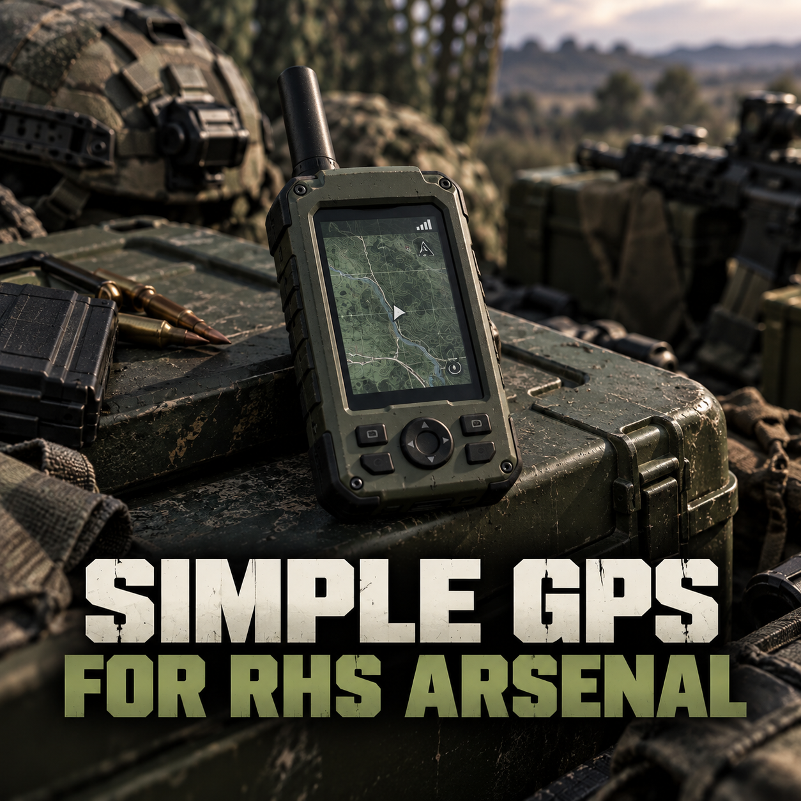

# Simple GPS for RHS Arsenal

An unofficial compatibility addon that adds the Simple GPS handheld receiver to the Equipment category of the RHS USAF and AFRF arsenals.

Source: https://github.com/eduvhc/simple-gps-rhs-arsenal

## Requirements

- [Simple GPS](https://reforger.armaplatform.com/workshop/B704D613E433276B-SimpleGPS)
- [RHS - Status Quo](https://reforger.armaplatform.com/workshop/595F2BF2F44836FB-RHS-StatusQuo)

## What it changes

- Adds one GPS entry to the RHS USAF Equipment catalog.
- Adds one GPS entry to the RHS AFRF Equipment catalog.
- Sets the supply cost to zero.

This addon contains only two catalog overrides (same GUID as the RHS `USMC_InventoryItems.conf` and `MSV_InventoryItems.conf`, delta-merged by the engine). It does not include or redistribute assets or code from either dependency.
